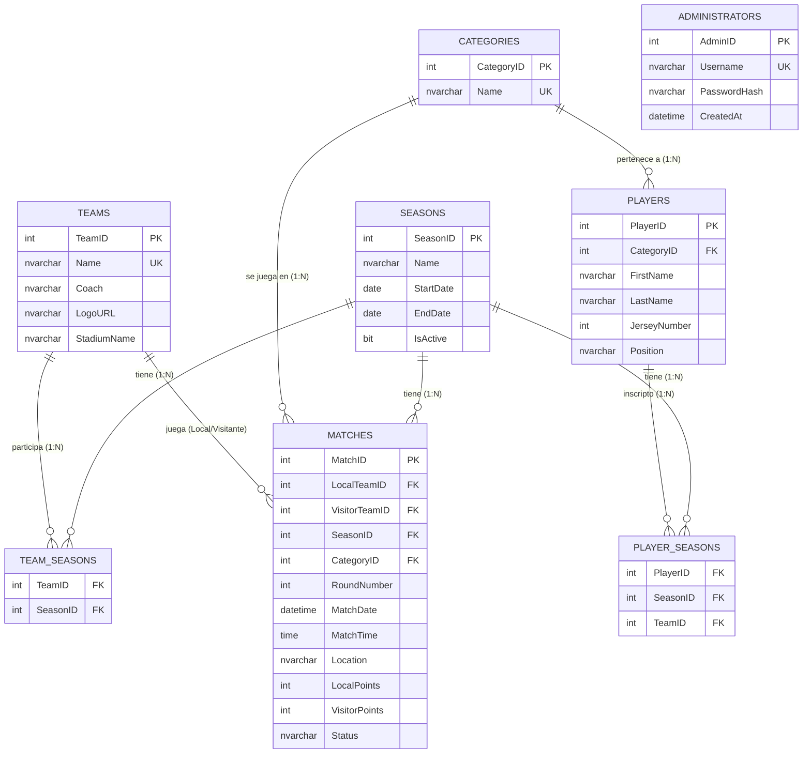

# Modelado de Datos

El modelo de datos de la plataforma está diseñado bajo un esquema relacional tradicional (SQL), optimizado para mantener la integridad referencial y facilitar consultas eficientes sobre las estadísticas de la liga. El sistema soporta múltiples temporadas y categorías simultáneamente.

> **Nota de Arquitectura**: En el backend de Node.js, cada una de estas entidades principales cuenta con una representación en la capa de datos dentro del directorio `src/models/` (ej. `Team.js`, `Player.js`, `Season.js`), garantizando el patrón MVC.

## 1. Diagrama de Entidad-Relación (DER)

El siguiente diagrama ilustra las relaciones entre las entidades principales del sistema, soportando el manejo multitemporada y multicategoría.

## 2. Vista de Tabla de Posiciones (`v_Standings`)

Para calcular la tabla de posiciones dinámicamente y con máxima eficiencia (sin requerir código complejo en el backend), se utiliza una View en la base de datos:

- La vista cruza los equipos activos en una temporada, con todas las categorías de la temporada.
- Acumula (SUM) `LocalPoints` y `VisitorPoints` basándose en el resultado de los partidos finalizados de `MATCHES`.
- Calcula: **Partidos Jugados (PJ)**, **Partidos Ganados (PG)**, **Partidos Perdidos (PP)**, **Puntos (Pts)** y **Diferencia de Tantos**.
- Se filtran según `SeasonID` y `CategoryID` dinámicamente desde el backend.