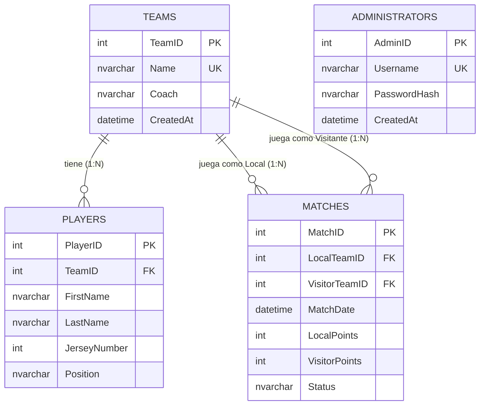

# Modelado de Datos

El modelo de datos de la plataforma está diseñado bajo un esquema relacional tradicional (SQL), optimizado para mantener la integridad referencial y facilitar consultas eficientes sobre las estadísticas de la liga.

## 1. Diagrama de Entidad-Relación (DER)

El siguiente diagrama ilustra las relaciones entre las entidades principales del sistema. 
*(Nota: GitHub renderizará este bloque de código como un diagrama visual automáticamente).*



## 2. Diagrama Lógico de la Base de Datos

El siguiente diagrama utiliza la notación de Mermaid para representar la trazabilidad de las llaves entre tablas. Las líneas indican la relación desde la **Primary Key (PK)** hacia donde se aloja como **Foreign Key (FK)**.

```mermaid
erDiagram
    ADMINISTRATORS {
        int AdminID PK "Identificador único"
        nvarchar Username "Nombre de usuario (Unique)"
        nvarchar PasswordHash "Hash de seguridad"
        datetime CreatedAt "Fecha de creación"
    }

    TEAMS {
        int TeamID PK "Identificador único"
        nvarchar Name "Nombre del equipo (Unique)"
        nvarchar Coach "Entrenador"
        datetime CreatedAt "Fecha de registro"
    }

    PLAYERS {
        int PlayerID PK "Identificador único"
        int TeamID FK "Referencia a TEAMS.TeamID"
        nvarchar FirstName "Nombre"
        nvarchar LastName "Apellido"
        int JerseyNumber "Nro de camiseta"
        nvarchar Position "Posición en campo"
    }

    MATCHES {
        int MatchID PK "Identificador único"
        int LocalTeamID FK "Referencia a TEAMS.TeamID (Local)"
        int VisitorTeamID FK "Referencia a TEAMS.TeamID (Visitante)"
        datetime MatchDate "Fecha y hora"
        int LocalPoints "Puntos local"
        int VisitorPoints "Puntos visitante"
        nvarchar Status "Estado del partido"
    }

    %% Definición de relaciones con trazabilidad de PK a FK
    TEAMS ||--o{ PLAYERS : "TeamID (PK) -> TeamID (FK)"
    TEAMS ||--o{ MATCHES : "TeamID (PK) -> LocalTeamID (FK)"
    TEAMS ||--o{ MATCHES : "TeamID (PK) -> VisitorTeamID (FK)"