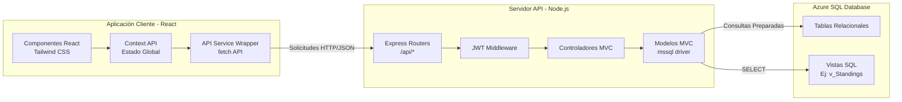
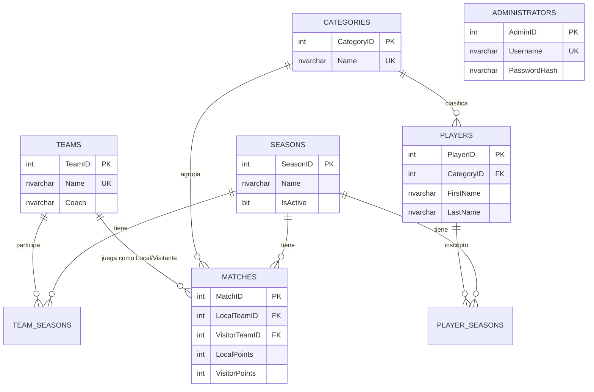
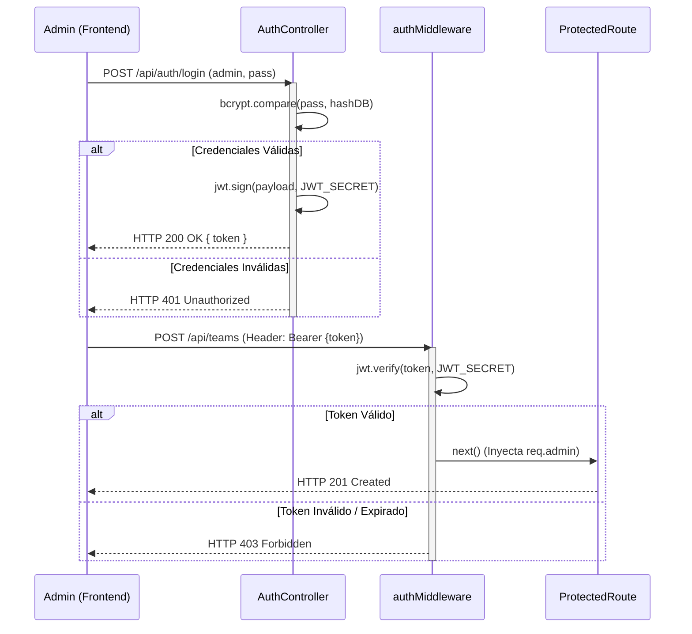

# Documentación Técnica Profundizada - TPO Liga Juvenil

Este documento detalla la ingeniería detrás de la plataforma de gestión deportiva. Describe exhaustivamente la arquitectura del sistema, los patrones de diseño aplicados (MVC, SPA), el modelo de datos relacional y las decisiones de seguridad.

---

## 1. Arquitectura de Sistemas y Componentes

El proyecto adopta una arquitectura Cliente-Servidor (desacoplada) donde el frontend y el backend operan como aplicaciones separadas que se comunican exclusivamente a través de una API REST.

### 1.1 Diagrama de Arquitectura Global



---

## 2. Modelado de Datos (SQL Server)

La base de datos fue normalizada para garantizar la integridad referencial y soportar la complejidad de múltiples temporadas (`Seasons`) y múltiples divisiones/categorías (`Categories`) en paralelo.

### 2.1 Diagrama Entidad-Relación (DER)



### 2.2 Motor de Cálculo de Posiciones (`v_Standings`)

En lugar de calcular las posiciones en la capa de la aplicación (JavaScript), lo cual requeriría transferir grandes volúmenes de datos por la red y ciclos de CPU ineficientes, el cálculo se descargó al motor de base de datos a través de una vista SQL compleja (`v_Standings`).

**Implementación SQL utilizando CTEs (Common Table Expressions):**
```sql
CREATE VIEW [dbo].[v_Standings] AS
WITH MatchStats AS (
    -- Estadísticas como equipo LOCAL
    SELECT 
        LocalTeamID AS TeamID, CategoryID, 1 AS Played,
        CASE WHEN LocalPoints > VisitorPoints THEN 3 WHEN LocalPoints = VisitorPoints THEN 1 ELSE 0 END AS Points,
        CASE WHEN LocalPoints > VisitorPoints THEN 1 ELSE 0 END AS Won,
        CASE WHEN LocalPoints = VisitorPoints THEN 1 ELSE 0 END AS Tied,
        CASE WHEN LocalPoints < VisitorPoints THEN 1 ELSE 0 END AS Lost,
        LocalPoints AS PointsFor, VisitorPoints AS PointsAgainst
    FROM Matches WHERE LocalPoints IS NOT NULL AND VisitorPoints IS NOT NULL
    
    UNION ALL
    
    -- Estadísticas como equipo VISITANTE
    SELECT 
        VisitorTeamID AS TeamID, CategoryID, 1 AS Played,
        CASE WHEN VisitorPoints > LocalPoints THEN 3 WHEN VisitorPoints = LocalPoints THEN 1 ELSE 0 END AS Points,
        CASE WHEN VisitorPoints > LocalPoints THEN 1 ELSE 0 END AS Won,
        CASE WHEN VisitorPoints = LocalPoints THEN 1 ELSE 0 END AS Tied,
        CASE WHEN VisitorPoints < LocalPoints THEN 1 ELSE 0 END AS Lost,
        VisitorPoints AS PointsFor, LocalPoints AS PointsAgainst
    FROM Matches WHERE LocalPoints IS NOT NULL AND VisitorPoints IS NOT NULL
)
SELECT 
    t.TeamID, t.Name AS Equipo, c.CategoryID,
    ISNULL(SUM(m.Points), 0) AS Puntos,
    ISNULL(SUM(m.Played), 0) AS PartidosJugados,
    ISNULL(SUM(m.Tied), 0) AS PartidosEmpatados,
    ISNULL(SUM(m.PointsFor) - SUM(m.PointsAgainst), 0) AS DiferenciaDeTantos
FROM Teams t
CROSS JOIN Categories c
LEFT JOIN MatchStats m ON t.TeamID = m.TeamID AND c.CategoryID = m.CategoryID
GROUP BY t.TeamID, t.Name, c.CategoryID;
```
*Esto permite que un simple `SELECT * FROM v_Standings ORDER BY Puntos DESC, DiferenciaDeTantos DESC` resuelva empates de forma nativa e instantánea.*

---

## 3. Desarrollo del Backend: Patrón MVC Desacoplado

### 3.1 Capa de Controladores (Controllers)
Los controladores manejan exclusivamente la desestructuración de peticiones HTTP, validación de parámetros y gestión de códigos de estado HTTP (200, 201, 400, 404, 500).

*Ejemplo de `teamController.js`:*
```javascript
exports.createTeam = async (req, res) => {
  try {
    const { Name, Coach, LogoURL, seasonId, StadiumName } = req.body;
    // Validación superficial
    if (!Name || !Coach) {
      return res.status(400).json({ message: 'Name and Coach are required.' });
    }
    // Delegación a la capa de Modelo
    const team = await TeamModel.create(Name, Coach, LogoURL, seasonId, StadiumName);
    res.status(201).json(team);
  } catch (error) {
    // Intercepción de violaciones de integridad de SQL Server (UK - Códigos 2627/2601)
    if (error.number === 2627 || error.number === 2601) {
      return res.status(400).json({ message: 'Ya existe un equipo con ese nombre.' });
    }
    res.status(500).json({ message: 'Error interno del servidor.' });
  }
};
```

### 3.2 Capa de Modelos (Models) y Prevención de Inyección SQL
Los modelos abstraen las interacciones con la base de datos utilizando el módulo `mssql`. Se utilizan **Consultas Parametrizadas** estrictamente (mediante `.input()`) para mitigar cualquier vulnerabilidad de Inyección SQL.

*Ejemplo de `TeamModel.js`:*
```javascript
const request = transaction.request()
  .input('Name', sql.NVarChar, Name)  // Variable inyectada de forma segura
  .input('Coach', sql.NVarChar, Coach);
  
const result = await request.query(
  'INSERT INTO Teams (Name, Coach) OUTPUT INSERTED.* VALUES (@Name, @Coach)'
);
```

---

## 4. Seguridad, Autenticación y Flujos de Autorización

### 4.1 Flujo JWT (Diagrama de Secuencia)

El sistema administrativo utiliza un modelo sin estado (Stateless) impulsado por JSON Web Tokens (JWT).



### 4.2 Criptografía (`seedAdmin.js`)
Las contraseñas de los administradores nunca se almacenan en texto plano. El script de inicialización (`seedAdmin.js`) utiliza `bcryptjs` para aplicar un *salt* con un factor de costo de 10 antes del hashing, protegiendo contra ataques de fuerza bruta y tablas arcoíris.

---

## 5. Arquitectura del Frontend (React SPA)

El cliente web es una aplicación robusta y reactiva.

### 5.1 Wrapper de Servicio API (`api.js`)
Para evitar duplicidad de código al interceptar tokens o capturar errores HTTP (Fetch API por defecto no lanza excepciones en errores 4xx o 5xx), se creó un wrapper centralizado.

*Extracto de `api.js`:*
```javascript
export async function apiRequest(path, { method = 'GET', body, auth = false } = {}) {
  const headers = { 'Content-Type': 'application/json' };
  
  if (auth) {
    const token = getToken(); // Extraído de localStorage
    if (token) headers.Authorization = `Bearer ${token}`;
  }

  const response = await fetch(path, { method, headers, body: JSON.stringify(body) });
  const data = await response.json();

  if (!response.ok) {
    // Transformamos los errores HTTP en excepciones nativas de JS
    throw new ApiError(data.message, response.status, data);
  }
  return data;
}
```

### 5.2 Estado Global (Context API)
- **`SeasonContext`**: Evita la "perforación de propiedades" (prop-drilling). Almacena el ID de la temporada actual. Si el usuario selecciona otra temporada en la cabecera (Navbar), el Context emite el cambio y los componentes suscritos (ej. `Standings`, `TeamList`) se re-renderizan haciendo fetch de los datos correspondientes.
- **`RightPanelContext`**: Maneja el estado (abierto/cerrado) y el contenido del panel deslizante que muestra detalles profundos (como el `TeamDetailsWidget` o `StandingsWidget`) sin necesidad de redirigir a una página nueva, proporcionando una experiencia de usuario altamente fluida.

### 5.3 Estilizado Modular (Tailwind CSS y Módulos)
Se combinó el uso de clases utilitarias de Tailwind con `CSS Modules` (`.module.css`) para componentes estructurales complejos, previniendo la colisión de nombres de clases a nivel global y asegurando el responsive design solicitado en la Landing Page y vistas interiores.
