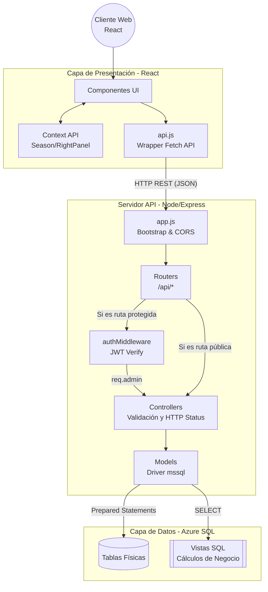
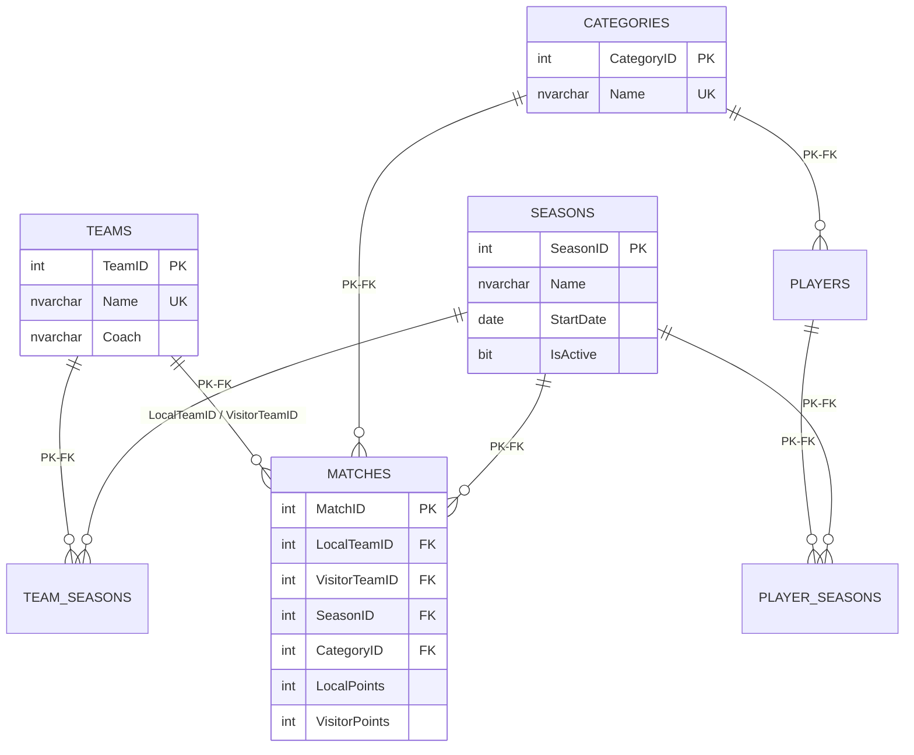
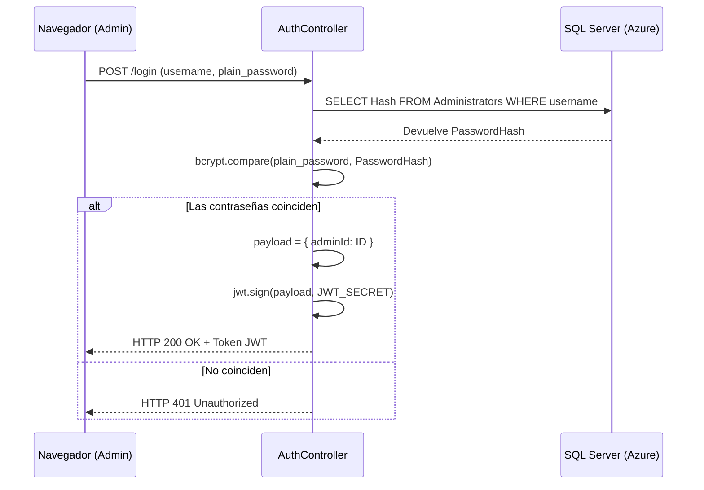

# TPO Liga Juvenil - Documentación Técnica y Arquitectónica Avanzada

Este documento proporciona una inmersión profunda en las decisiones de ingeniería, patrones de arquitectura, diseño de base de datos e implementación técnica del código de la Liga de Básquet Juvenil. Está diseñado para que cualquier ingeniero de software pueda comprender la lógica interna, mantener el código y desplegar el proyecto.

---

## 1. Stack Tecnológico y Requisitos

### 1.1 Frontend
- **Framework**: React 18
- **Build Tool**: Vite (proporciona HMR instantáneo)
- **Estilos**: Tailwind CSS combinado con CSS Modules
- **Enrutamiento**: React Router v6

### 1.2 Backend
- **Entorno**: Node.js
- **Framework**: Express.js
- **Seguridad**: JWT (JSON Web Tokens) para autenticación sin estado y `bcryptjs` para el hash de contraseñas
- **Conector BD**: `mssql` (Microsoft SQL Server driver para Node.js)

### 1.3 Base de Datos
- **Motor**: Microsoft SQL Server (Alojado en Azure SQL)
- **Lógica en BD**: Procedimientos almacenados y Vistas SQL (ej. cálculo de tabla de posiciones)

---

## 2. Visión General de la Arquitectura (High-Level Architecture)

El proyecto adopta una arquitectura de **Cliente-Servidor completamente desacoplada**. 
1. **Frontend (SPA)**: Una Single Page Application desarrollada en React que maneja todo el enrutamiento visual, estado global y renderizado de la UI.
2. **Backend (API RESTful)**: Un servidor Node.js/Express sin estado (stateless) que expone endpoints JSON, procesa la lógica de autorización y abstrae la capa de datos.
3. **Database (RDBMS)**: Una base de datos Microsoft SQL Server alojada en Azure, encargada de la persistencia, integridad referencial y de cálculos matemáticos complejos mediante Vistas SQL.

### 2.1 Diagrama de Flujo del Sistema



---

## 3. Ingeniería del Backend (Node.js & Express)

El backend sigue un patrón arquitectónico **MVC (Model-View-Controller) Desacoplado**. Dado que es una API, la "Vista" no existe en el servidor; el servidor solo despacha datos crudos en formato JSON.

### 3.1 Bootstrapping y Configuración (`app.js`)
El archivo `app.js` es el núcleo donde se instancian los middlewares globales antes de llegar a las rutas. 

```javascript
const express = require('express');
const cors = require('cors');

const app = express();

// Habilitación de Cross-Origin Resource Sharing
app.use(cors());
// Parsing automático de payloads JSON entrantes
app.use(express.json());
// Parsing de datos URL-encoded
app.use(express.urlencoded({ extended: true }));

// Montaje dinámico de los routers
app.use('/api/teams', require('./routes/teamRoutes'));
app.use('/api/auth', require('./routes/authRoutes'));
// ...
```
Esta separación de `app.js` de `server.js` permite aislar la lógica de Express para facilitar futuras pruebas unitarias sin levantar el puerto HTTP.

### 3.2 Capa de Middlewares y Autorización (`authMiddleware.js`)
Para proteger las rutas que mutan el estado de la aplicación (POST, PUT, DELETE), se diseñó un middleware que intercepta las peticiones y valida criptográficamente un Token JWT.

```javascript
const jwt = require('jsonwebtoken');

module.exports = function(req, res, next) {
  const authHeader = req.header('Authorization');
  let token;

  // 1. Extraer el Bearer Token del header
  if (authHeader && authHeader.startsWith('Bearer ')) {
    token = authHeader.split(' ')[1];
  }

  // 2. Rechazo preventivo
  if (!token) return res.status(401).json({ message: 'No token, authorization denied' });

  try {
    // 3. Verificación asimétrica usando JWT_SECRET
    // Lanza excepción si el token expiró o fue manipulado
    const decoded = jwt.verify(token, process.env.JWT_SECRET);
    
    // 4. Inyección del payload en el ciclo de vida de la request
    req.admin = decoded.admin;
    
    // 5. Transferir control al Controller
    next();
  } catch (err) {
    res.status(401).json({ message: 'Token is not valid' });
  }
};
```

### 3.3 Capa de Controladores (Controllers)
Los controladores son responsables del flujo de la solicitud HTTP. Extraen los datos de `req.body` o `req.params`, llaman a los Modelos y formatean la salida. Capturan excepciones específicas de la base de datos (por ejemplo, errores de clave única) para transformarlos en mensajes de error amigables al usuario (HTTP 400).

```javascript
exports.createTeam = async (req, res) => {
  try {
    const { Name, Coach, LogoURL, seasonId, StadiumName } = req.body;
    
    // Early return para validaciones básicas
    if (!Name || !Coach) {
      return res.status(400).json({ message: 'Name and Coach are required.' });
    }
    
    // Delegación estricta de lógica de persistencia al Model
    const team = await TeamModel.create(Name, Coach, LogoURL, seasonId, StadiumName);
    res.status(201).json(team);
    
  } catch (error) {
    // Captura de violación de Restricción Única (Unique Constraint) de SQL Server
    if (error.number === 2627 || error.number === 2601) {
      return res.status(400).json({ message: 'Ya existe un equipo registrado con ese nombre.' });
    }
    res.status(500).json({ message: 'Internal server error.' });
  }
};
```

### 3.4 Capa de Modelos e Inyección SQL
La base de datos utiliza `mssql`. Se utiliza un patrón de `Connection Pool` único, inicializado al arrancar la aplicación (`config/db.js`), para evitar la sobrecarga de abrir y cerrar conexiones TCP por cada request.

**Seguridad contra Inyección SQL**: En la capa de Modelos, NUNCA se concatenan strings para formar consultas SQL. Se utilizan **Prepared Statements** mediante `.input()`, lo cual parametriza los tipos de datos a nivel binario en el driver antes de enviarlos a SQL Server.

```javascript
// backend/src/models/Team.js
const result = await transaction.request()
  .input('Name', sql.NVarChar, Name)  // Saneamiento automático
  .input('Coach', sql.NVarChar, Coach)
  .query('INSERT INTO Teams (Name, Coach) OUTPUT INSERTED.* VALUES (@Name, @Coach)');
```

### 3.5 Endpoints y Operaciones CRUD (API REST)
A continuación se detallan los endpoints REST expuestos por el backend. Las rutas marcadas con **(Auth)** requieren autenticación mediante token JWT en los headers (`Authorization: Bearer <token>`).

#### Teams (`/api/teams`)
- `GET /` : Obtiene el listado de todos los equipos.
- `GET /:id` : Obtiene los detalles de un equipo específico por su ID.
- `POST /` **(Auth)** : Crea un nuevo equipo.
- `PUT /:id` **(Auth)** : Actualiza la información de un equipo existente.
- `DELETE /:id` **(Auth)** : Elimina un equipo.

#### Players (`/api/players`)
- `GET /` : Obtiene el listado de todos los jugadores.
- `GET /:id` : Obtiene los detalles de un jugador específico.
- `GET /team/:teamId` : Obtiene los jugadores que pertenecen a un equipo específico.
- `POST /` **(Auth)** : Registra un nuevo jugador.
- `PUT /:id` **(Auth)** : Actualiza la información de un jugador existente.
- `DELETE /:id` **(Auth)** : Elimina un jugador.

#### Matches (`/api/matches`)
- `GET /` : Obtiene todos los partidos programados y jugados.
- `GET /:id` : Obtiene los detalles de un partido específico.
- `POST /` **(Auth)** : Crea un nuevo partido.
- `PUT /:id` **(Auth)** : Actualiza un partido (por ejemplo, cargar el resultado y los puntos).
- `DELETE /:id` **(Auth)** : Elimina un partido del registro.

#### Seasons (`/api/seasons`)
- `GET /` : Obtiene el listado de todas las temporadas.
- `GET /active` : Obtiene la temporada que se encuentra actualmente activa.
- `POST /` **(Auth)** : Crea una nueva temporada.
- `PUT /:id` **(Auth)** : Actualiza la configuración de una temporada.
- `DELETE /:id` **(Auth)** : Elimina una temporada.
- `POST /:id/finish` **(Auth)** : Marca una temporada como finalizada.
- `POST /:id/revert-finish` **(Auth)** : Revierte el estado de una temporada finalizada a activa.

#### Categories (`/api/categories`)
- `GET /` : Obtiene el listado de todas las categorías (ej. U13, U15, Primera).
- `POST /` **(Auth)** : Crea una nueva categoría.
- `PUT /:id` **(Auth)** : Actualiza el nombre o detalles de una categoría.
- `DELETE /:id` **(Auth)** : Elimina una categoría.

#### Standings (`/api/standings`)
- `GET /` : Obtiene la tabla de posiciones calculada (puede requerir parámetros como `seasonId` o `categoryId`).

#### Auth (`/api/auth`)
- `POST /login` : Autentica al usuario administrador y devuelve el token JWT para acceder a las rutas protegidas.

---

## 4. Modelo de Datos Relacional y Lógica de Negocio (Azure SQL)

### 4.1 Diagrama Entidad-Relación (DER) Técnico


*El sistema soporta una arquitectura multicategoría y multitemporada. Los jugadores y equipos se "inscriben" en una temporada y categoría a través de tablas intermedias (ej. `TeamSeasons`), evitando duplicar la información base del equipo.*

### 4.2 Descarga de Lógica al Motor SQL (`v_Standings`)
Uno de los mayores logros de ingeniería del proyecto es la delegación del cálculo matemático de las posiciones (Standings) directamente al procesador transaccional de Azure SQL. En lugar de traer miles de partidos a NodeJS en memoria (anti-patrón `N+1` y cuellos de botella de memoria), se diseñó una Vista SQL de alto rendimiento.

**Implementación (Extracto SQL real):**
```sql
-- Uso de CTE (Common Table Expression) para normalizar resultados locales y visitantes
WITH MatchStats AS (
    -- SELECT de Equipos Locales
    SELECT 
        LocalTeamID AS TeamID, CategoryID, 1 AS Played,
        CASE 
            WHEN LocalPoints > VisitorPoints THEN 3 -- 3 Pts por Ganar
            WHEN LocalPoints = VisitorPoints THEN 1 -- 1 Pt por Empatar
            ELSE 0 
        END AS Points,
        LocalPoints AS PointsFor, VisitorPoints AS PointsAgainst
    FROM Matches WHERE LocalPoints IS NOT NULL AND VisitorPoints IS NOT NULL
    
    UNION ALL
    -- SELECT de Equipos Visitantes (misma lógica)
)
-- Agregación Final
SELECT 
    t.TeamID, t.Name AS Equipo, c.CategoryID,
    ISNULL(SUM(m.Points), 0) AS Puntos,
    ISNULL(SUM(m.Played), 0) AS PartidosJugados,
    ISNULL(SUM(m.PointsFor) - SUM(m.PointsAgainst), 0) AS DiferenciaDeTantos
FROM Teams t
CROSS JOIN Categories c
LEFT JOIN MatchStats m ON t.TeamID = m.TeamID AND c.CategoryID = m.CategoryID
GROUP BY t.TeamID, t.Name, c.CategoryID;
```

De esta manera, el Backend Node.js (`Standing.js`) simplemente hace un select básico con el orden correcto, y SQL Server aplica sus índices B-Tree internamente para ordenar el resultado de forma ultrarrápida:
`SELECT * FROM v_Standings WHERE SeasonID = @SeasonId ORDER BY Puntos DESC, DiferenciaDeTantos DESC`

### 4.3 Optimización de Índices y Consultas SQL (Performance y OR Clauses)
Para soportar una alta carga transaccional y evitar ralentizaciones al consultar equipos específicos, se aplicaron estrategias avanzadas de base de datos y backend:

1. **Covering Indexes y Optimización de Claves Foráneas**: Se crearon índices no clústerados (`IX_Matches_Season_Category_Alt`, `IX_Matches_LocalTeam`, `IX_Matches_VisitorTeam`, `IX_PlayerSeasons_Team`) que le permiten al motor SQL resolver las consultas críticas directamente desde el árbol de índices (B-Tree), evitando escanear las páginas físicas de la tabla completa (Full Table Scan).
2. **Reemplazo del Operador OR por UNION**: Originalmente, buscar todos los partidos de un equipo usaba `WHERE LocalTeamID = X OR VisitorTeamID = X`. Los motores SQL suelen degradar el rendimiento a escaneos completos frente a múltiples condiciones `OR`. Se reemplazó por un bloque `UNION`, forzando al motor a hacer dos búsquedas instantáneas por índice (Index Seek) y unificarlas, mejorando drásticamente el tiempo de respuesta.
3. **Paralelización de Awaits (Backend)**: Cuando el frontend solicita los detalles de un equipo (jugadores, partidos, historia), el backend (`Team.js`) lanza todas las consultas asincrónicas simultáneamente utilizando `Promise.all` e instanciando múltiples objetos request del pool, en lugar de ejecutarlas de forma secuencial. Esto reduce el tiempo de resolución en hasta un 300%.

---

## 5. Ingeniería del Frontend (React SPA)

El frontend utiliza **React 18** ensamblado con **Vite**, lo cual brinda un entorno de desarrollo de Hot Module Replacement (HMR) casi instantáneo.

### 5.1 Patrón Wrapper para Fetch API (`api.js`)
La API nativa `fetch` de los navegadores tiene un defecto: no lanza excepciones cuando recibe errores HTTP `400` o `500`. Para solucionar esto y centralizar la inyección del Token JWT, se implementó el wrapper `apiRequest`.

```javascript
// frontend/src/services/api.js
export async function apiRequest(path, { method = 'GET', body, auth = false } = {}) {
  const headers = {};
  if (body) headers['Content-Type'] = 'application/json';

  if (auth) {
    const token = getToken(); // Lee de localStorage
    if (token) headers.Authorization = `Bearer ${token}`;
  }

  const response = await fetch(path, { method, headers, body: body ? JSON.stringify(body) : undefined });
  const data = await response.json().catch(() => null);

  if (!response.ok) {
    // Convierte el fallo HTTP en una excepción de Javascript atrapable en un try/catch
    throw new ApiError(data?.message || 'Error de API', response.status, data);
  }
  return data;
}
```
Esto permite a los componentes de UI hacer simplemente:
`const teams = await apiRequest('/api/teams', { auth: true })` y capturar el error con `try/catch`.

### 5.2 Gestión del Estado Global (Context API)
- **`SeasonContext.jsx`**: Aloja el `selectedSeasonId`. Envuelve toda la aplicación en `main.jsx`. Cuando el usuario cambia la temporada en el `<select>` del Header, el Context emite la actualización. Todos los componentes hijos (como `Standings.jsx` o `TeamList.jsx`) escuchan este estado a través de `useEffect` y automáticamente refetchdean los datos de esa temporada específica, dándole a la app una sensación de instantaneidad total.
- **`RightPanelContext.jsx`**: Es un patrón avanzado para mantener al usuario en contexto. Al cliquear un equipo en una tabla, en lugar de navegar a `/team/5` y recargar la página, se invoca `openPanel(<TeamDetailsWidget teamId={5} />)`. Esto abre un panel lateral dinámico manteniendo la tabla de posiciones detrás (Single Page Experience).

### 5.3 Carga Diferida y UI No Bloqueante (Non-Blocking UI)
Para evitar pantallas de carga (spinners) excesivamente largas, los componentes más pesados como `TeamDetailsWidget` desacoplan la carga de datos. Cuando se selecciona un equipo, se solicita la información principal del equipo de forma aislada a la solicitud del rango de posiciones (standings). Al recibir la información del equipo, se renderiza inmediatamente, mientras los datos estadísticos complementarios se resuelven en segundo plano, mejorando sustancialmente la experiencia de usuario y percepción de velocidad. Adicionalmente, se integró soporte nativo (`scrollbar-width: none`) para mantener paneles navegables pero visualmente limpios y modernos.

### 5.4 Diseño Modular (CSS y Tailwind)
Se combinó el framework de utilidad de Tailwind CSS (para el esqueleto base y responsividad) con `CSS Modules` (`styles.module.css`). Esto significa que las clases CSS son hasheadas durante el build de Vite (ej. `_TeamCard_1x8d2`), garantizando que no existan colisiones de estilos entre diferentes componentes de la aplicación.

---

## 6. Seguridad y Criptografía Complementaria

### 6.1 Diagrama de Autenticación Sin Estado



### 6.2 Hashing de Contraseñas (`seedAdmin.js`)
El sistema administrativo nunca guarda contraseñas en texto plano, de lo contrario, una fuga de datos expondría las credenciales. Se utiliza la librería `bcryptjs`. 

El script `backend/src/scripts/seedAdmin.js` automatiza este proceso:
```javascript
const bcrypt = require('bcryptjs');

// 1. Generación de un "salt" (cadena aleatoria) con factor de trabajo de 10.
// Esto mitiga drásticamente la viabilidad de ataques por Tablas Arcoíris (Rainbow Tables).
const salt = await bcrypt.genSalt(10);

// 2. Aplicación del hash derivativo.
const passwordHash = await bcrypt.hash('TPO_Admin_2026', salt);

// 3. Inserción en la base de datos de la cadena irreversible.
await pool.request()
  .input('Username', sql.NVarChar, 'admin')
  .input('PasswordHash', sql.NVarChar, passwordHash)
  .query('INSERT INTO Administrators (Username, PasswordHash) VALUES (@Username, @PasswordHash)');
```

---

## 7. Configuración y Ejecución del Proyecto

### 7.1 Variables de Entorno (`.env`)
Por estándares de seguridad, el archivo `.env` original (que contiene las credenciales de la base de datos y las claves privadas) **se excluye del control de versiones** (no se sube a GitHub). 
Para levantar el proyecto localmente, debes solicitar el archivo `.env` válido al administrador del proyecto o crear uno propio en la raíz del directorio `/backend` usando la siguiente estructura de ejemplo:

```env
PORT=3000
DB_USER=<TU_USUARIO_SQL>
DB_PASSWORD=<TU_CONTRASEÑA_SQL>
DB_SERVER=<TU_SERVIDOR_AZURE>.database.windows.net
DB_NAME=<NOMBRE_DE_TU_BD>
JWT_SECRET=<TU_CLAVE_SECRETA_JWT>
```
*Nota: Asegúrate de nunca hacer un `git commit` de tus credenciales reales.*

### 7.2 Comandos de Ejecución Local
La estructura de este repositorio requiere levantar ambos entornos (front y back) simultáneamente o configurar un script para ello.

1. **Instalación de dependencias**:
   ```bash
   # En la raíz (si existe package.json que maneja ambos) o independientemente:
   cd backend && npm install
   cd ../frontend && npm install
   ```

2. **Ejecutar Entorno de Desarrollo (Dev)**:
   ```bash
   # En la raíz del proyecto (npm run dev ejecuta ambos concurrentemente)
   npm run dev
   ```
   *Esto iniciará el backend en el puerto 3000 y el frontend Vite en el puerto 5173.*

Con este profundo análisis, el software demuestra aplicar conceptos de bases de datos complejas, patrones de ingeniería de software, y seguridad informática integral.
